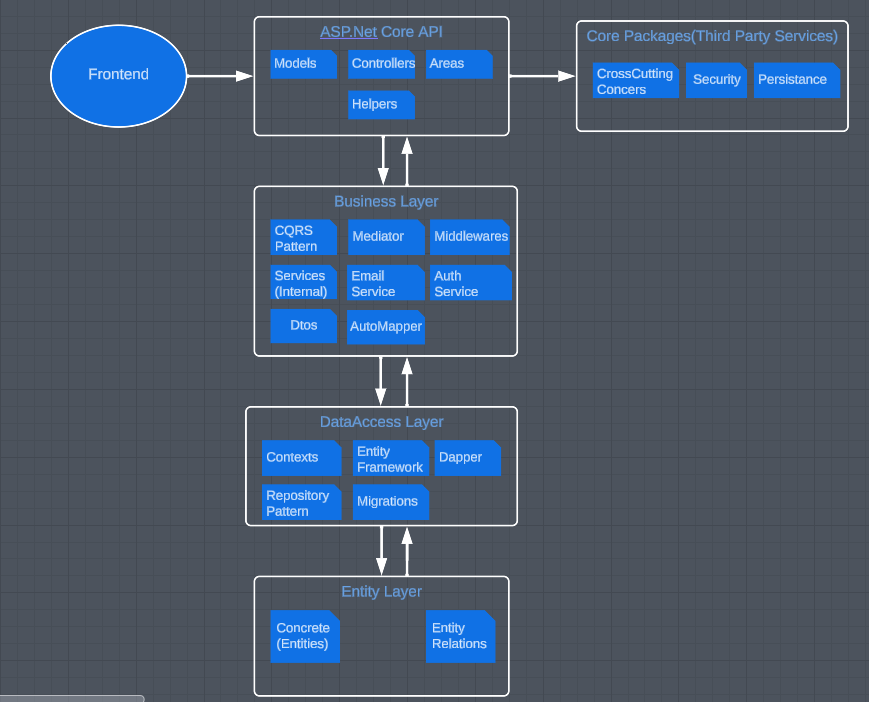

<h1>DailyShop 2.El E-Ticaret Sitesi</h1>

<h3>Kullanılan Teknolojiler:</h3>
Asp.Net Core 6 Mvc API, EntityFrameworkCore ,Dapper, Classic Architecture,
Generic Repository Design Pattern, CQRS Design Pattern,AutoMapper,JWT,Asp.Net Areas,Swagger,Postman
  
Projenin frontend kısmına https://github.com/Mstfucrr/React-DailyShop linkinden ulaşabilirsiniz.

<h3>Projede Kullanılan Mimarinin Genel Hatları</h3>

<h3>Kullanılan Dil: C#</h3>

<h3>Kullanıcı Senaryoları(UseCases)

<ul>
    <li>Admin Senaryoları  </li>
    <li>Giriş yap, Kayıt ol ve Kullanıcı Hesap Senaryoları  </li>
    <li>Müşteri-Ürün ilişkisi Senaryoları  </li>
    <li>Sipariş verme, Satıcı Olma ve Cüzdan Senaryoları  </li>
</ul>
