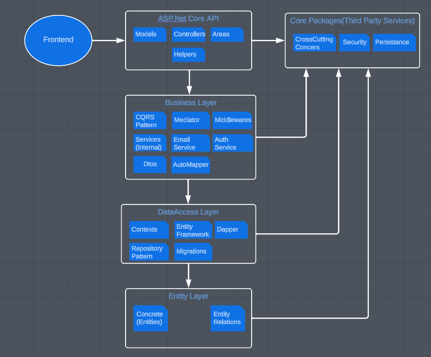
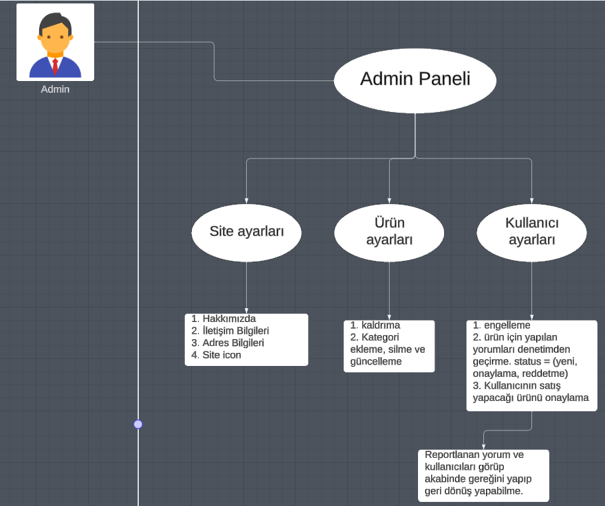
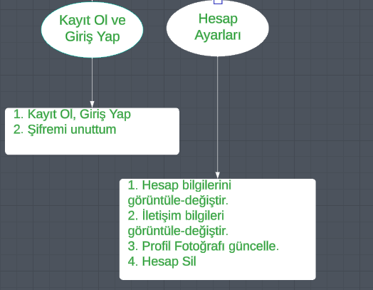
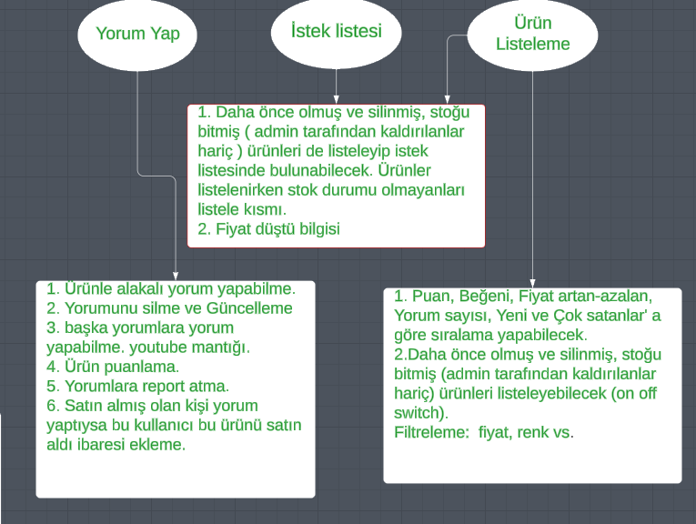
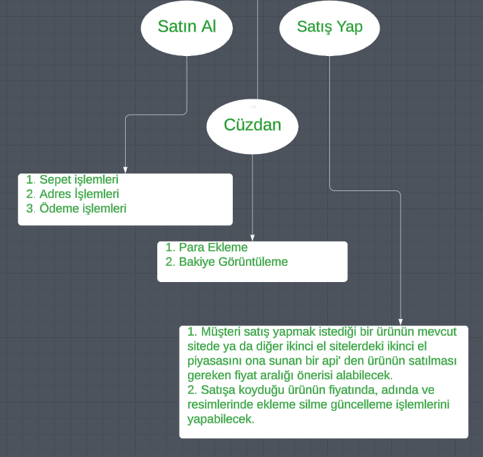

<h1>DailyShop 2.El E-Ticaret Sitesi</h1>
Gerçekleştirdiğimiz bu proje ikinci el ürün alım satım yapmayı hedefleyen bir e-ticaret sitesidir. Kullanıcılar istedikleri ürünleri kolay ve güvenilir bir şekilde alabilecek, satabileceklerdir.  
Proje'de görmüş olduğunuz bu repo dışında ayrıca 2 repo daha bulunmaktadır. Bunlardan biri projenin frontend'inin yer aldığı bir repo diğeri ise satış yapmak isteyen bir kullanıcıya kolaylık sağlaması için satmak istediği ürün ile ilgili bir veritabanını tarayarak ve bunlardan elde edilen datalar üzerinde bir takım makine öğrenmesi algoritmaları kullanarak kullanıcıya bir fiyat önerisi sunan python ile yazılmış bir api. Bahsedilen bu repolara aşağıdaki bağlantılardan ulaşabilirsiniz.  

Frontend:  https://github.com/Mstfucrr/React-DailyShop  
Fiyat Öneri Api: https://github.com/Mstfucrr/DailyShopProjeAi

<h3>1. Kullanılan Teknolojiler:</h3>

Asp.Net Core 6 Mvc API, EntityFrameworkCore ,Dapper, Classic Architecture,
Generic Repository Design Pattern, CQRS Design Pattern,AutoMapper,JWT,Asp.Net Areas,Swagger,Postman

<h3>2. Projede Kullanılan Mimarinin Genel Hatları</h3>

<h3>3. Kullanılan Dil ve Geliştirme Ortamı: C# - Asp.Net Core 6.0</h3>
<h4>Not: Proje .Net 6.0 ile geliştirilmiştir. Eğer sizde .Net 6.0 ortamı kurulu değil ise "visual studio installer" aracından "bağımsız bileşenler" kısmına gelip .Net 6.0 ile ilgili yazan paketleri seçip değiştir'e tıklayın.</h4>
<h3>4. Kurulum: </h3>
 - Projede DailyShop.API katmanında appsettings.json dosyasını açın, ConnectionStrings kısmında belirtilen veritabanı bağlantı dizesini kendi veritabanı bağlantı dizenize göre güncelleyin. 
 - Ardından Visual Studio aracının üst sekmesinden view -> other windows -> package manager console kısmına tıklayın. 
 - Ardından açılan pencerede default project yazan yere tıklayıp açılan seçim ekranından DailyShop.DataAccess'e tıklayın 
 - Açılan pencereye "update-database" yazıp enter'a tıklayın.(ilgili veritabanı ve tabloları SSMS'de oluşacaktır.) 
 - Ardından DailyShop.API projesine sağ tık yapıp "Set as Startup Project" deyin ve API'yi ayağa kaldırın.

<h3>5. Kullanıcı Senaryoları(UseCases)

<ul>
    <li>Admin Senaryoları  </li>
    <li>Giriş yap, Kayıt ol ve Kullanıcı Hesap Senaryoları  </li>
    <li>Müşteri-Ürün ilişkisi Senaryoları  </li>
    <li>Sipariş verme, Satıcı Olma ve Cüzdan Senaryoları  </li>
</ul>
<h3>6. Gereksinim Dökümanı:</h3>
<h3>5. Kullanılan Tablolar</h3>

<ul>
    <li>AppUsers, Carts, CartItems, Categories, Claims, Colors, Favorites, OrderAddress, Orders, OrderItems, Payments, Products, ProductImages, ReportReviews, ReportUsers, Reviews, Sizes, Wallets, WebSiteSettings ...</li>
</ul>

<h3>6. Emeği Geçenler</h3>

<ul>
    <li>Osman Tonbul (Backend)</li>
    <li>Muhammet Mustafa Uçar (Frontend and AI)</li>
</ul>
