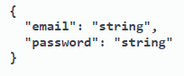
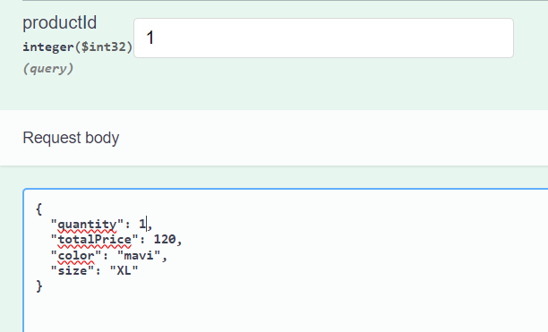
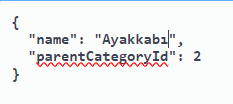
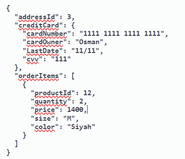
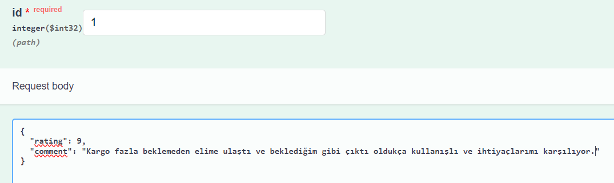

<h1>DailyShop 2.El E-Ticaret Sitesi</h1>
<h3>1. Giriş:</h3>

Gerçekleştirdiğimiz bu proje ikinci el ürün alım satım yapmayı hedefleyen bir e-ticaret sitesidir. Kullanıcılar istedikleri ürünleri kolay ve güvenilir bir şekilde alabilecek, satabileceklerdir. Projede kullanıcılar, istedikleri ürünleri arayıp bulabiliyorlar, farklı kategorilere ve filtreleme seçeneklerine göre ürünleri sıralayıp istedikleri ürünleri istek listesine ekleyebiliyorlar.
Satıcılar, ürünlerini satışa çıkarabiliyor fiyatında, adında ve resimlerinde ekleme silme güncelleme işlemlerini yapabiliyorlar. Aynı zamanda satışa çıkarmak istediği ürünün satış fiyatını belirlemesini kolaylaştırmak için de makine öğrenmesi yardımıyla harici bir api'den fiyat önerisinde bulunabiliyorlar. Ürün değerlendirmeleri ve geri bildirimler de platformun önemli bir parçasıdır. Kullanıcılar, satın aldıkları ürünleri değerlendirip geri bildirimde bulunabiliyorlar, ayrıca diğer kullanıcıların yorumlarını görebilmelerinin yanı sıra yorumlara like-dislike atma ve report etme gibi işlemlerde de bulunabiliyorlar vs. vs. çok daha fazlası için aşağıda 7. kısımda yer alan gereksinim dökümanını inceleyebilirsiniz veya projeyi ayağa kaldırıp tüm işlemleri rahat bir şekilde görebilir deneyimleyebilirsiniz.
   
Proje'de görmüş olduğunuz bu repo dışında ayrıca 2 repo daha bulunmaktadır. Bunlardan biri projenin frontend'inin yer aldığı bir repo diğeri ise satış yapmak isteyen bir kullanıcıya kolaylık sağlaması için satmak istediği ürün ile ilgili bir veritabanını tarayarak ve bunlardan elde edilen datalar üzerinde bir takım makine öğrenmesi algoritmaları kullanarak kullanıcıya bir fiyat önerisi sunan python ile yazılmış bir api. Bahsedilen bu repolara aşağıdaki bağlantılardan ulaşabilirsiniz. Geliştirmiş olduğumuz bu proje "Lisans Tez Projesi" olarak geliştirilmiş ve teslim edilmiştir.

Frontend:  https://github.com/Mstfucrr/React-DailyShop  
Fiyat Öneri Api: https://github.com/Mstfucrr/DailyShopProjeAi

<h3>2. Kullanılan Teknolojiler:</h3>

Asp.Net Core 6 Mvc API, EntityFrameworkCore ,Dapper, Classic Architecture,
Generic Repository Design Pattern, CQRS Design Pattern,AutoMapper,JWT,Asp.Net Areas,Swagger,Postman,MSSQL

<h3>3. Projede Kullanılan Mimarinin Genel Hatları</h3>

<h3>4. Kullanılan Dil ve Geliştirme Ortamı: C# - Asp.Net Core 6.0</h3>

<h3>5. Kurulum: </h3>

 - Projede DailyShop.API katmanında appsettings.json dosyasını açınız, ConnectionStrings kısmında belirtilen veritabanı bağlantı dizesini kendi veritabanı bağlantı dizenize göre güncelleyiniz. 
 - Ardından Visual Studio aracının üst sekmesinden view -> other windows -> package manager console kısmına tıklayınız. 
 - Ardından açılan pencerede default project yazan yere tıklayıp açılan seçim ekranından DailyShop.DataAccess'e tıklayınız 
 - Açılan pencereye "update-database" yazıp enter'a tıklayınız.(ilgili veritabanı ve tabloları SSMS'de oluşacaktır.) 
 - Ardından DailyShop.API projesine sağ tık yapıp "Set as Startup Project" deyiniz ve API'yi ayağa kaldırınız.

<h3>6. Kullanıcı Senaryoları(UseCases)</h3>

<ul>
    <li>Admin Senaryoları  </li>
    <li>Giriş yap, Kayıt ol ve Kullanıcı Hesap Senaryoları  </li>
    <li>Müşteri-Ürün ilişkisi Senaryoları  </li>
    <li>Sipariş verme, Satıcı Olma ve Cüzdan Senaryoları  </li>
</ul>
<h3>7. Gereksinim Dökümanı</h3>

<h4>Kullanıcı Kaydı ve Girişi</h4>
<ul>
    <li>Kullanıcıların platforma kaydolabilmesi ve hesap oluşturabilmesi.</li>
    <li>Güvenli ve kullanıcı dostu bir giriş ve oturum açma işlemi.</li>
    <li>Şifremi unuttum işlemi.</li>
</ul>
<h4>Ürün Arama, Sıralama ve Filtreleme</h4>
<ul>
    <li>Kullanıcıların istedikleri ürünleri kolaylıkla bulabilmesi</li>
    <li>Farklı kategorilere ve filtreleme seçeneklerine göre ürün arama imkânı.</li>
    <li>Kullanıcının Puan, beğeni, fiyat artan-azalan, yorum sayısı yeni ve çok satanlar şeklinde sıralayabilmesi.</li>
    <li>Kullanıcı Daha önce olmuş ve silinmiş, stoğu bitmiş ( admin tarafından kaldırılanlar hariç ) ürünleri de listeleyip istek listesine ekleyebilecek.</li>
</ul>
<h4>Satıcı Hesap Yönetimi</h4>
<ul>
    <li>Kullanıcıların satıcı olarak hesap açabilmesi ve ürünlerini listeleme imkânı</li>
    <li>Satışa koyduğu ürünün fiyatında, adında ve resimlerinde ekleme silme güncelleme işlemlerini yapabilecek.</li>
    <li>Müşteri satış yapmak istediği bir ürünün mevcut sitede 2. El piyasasının ortalamasını alan bi apiden koyması gereken önerilen fiyat aralığı alabilecek.</li>
</ul>
<h4>Hesap Yönetimi</h4>
<ul>
    <li>Kullanıcı hesap bilgilerini ve profil fotoğrafını görüntüleme, silme ve güncelleme işlemlerinde bulunabilecek.</li>
    <li>Kullanıcı iletişim bilgilerinde ekleme görüntüleme, silme ve güncelleme işlemlerinde bulunabilecek</li>
    <li>Kullanıcı adres bilgilerinde ekleme, görüntüleme, silme ve güncelleme işlemlerinde bulunabilecek.</li>
</ul>
<h4>Ürün Değerlendirmeleri ve Geri Bildirimler</h4>
<ul>
    <li>Kullanıcıların satın aldıkları ürünleri değerlendirebilmesi ve geri bildirimde bulunabilmesi.</li>
    <li>Satın almış kişi yorum yaptıysa bu kullanıcı bu ürünü satın aldı ibaresi ekleme.</li>
    <li>Diğer kullanıcıların ürünler hakkında bilgi sahibi olabilmesi için kullanıcı yorumlarının desteklenmesi.</li>
    <li>Ürünle alakalı yorum yapabilme.</li>
    <li>Kullanıcının yaptığı yorumu güncelleyip silebilme.</li>
    <li>Başka kullanıcıların yorumlarına yorum yapabilme (cevaplayabilme)</li>
    <li>Ürün Puanlama</li>
    <li>Yorumlara like-dislike atabilme.</li>
    <li>Yorumlara ve ürünlere report ( admine bildiride buluma ) atabilme.</li>
</ul>
<h4>Cüzdan İşlemleri</h4>
<ul>
    <li>Para Ekleme</li>
    <li>Bakiye Görüntüleme</li>
</ul>
<h3>8. Kullanılan Tablolar</h3>

<ul>
    <li>AppUsers, Carts, CartItems, Categories, Claims, Colors, Favorites, OrderAddress, Orders, OrderItems, Payments, Products, ProductImages, ReportReviews, ReportUsers, Reviews, Sizes, Wallets, WebSiteSettings ...</li>
</ul>
<h3>9. Örnek API İstekleri</h3>
<ul>
    <li>Login</li>
    
    <li>Sepet'e ürün ekleme</li>
    
    <li>Kategori ekleme</li>
    
    <li>Sipariş verme</li>
    
    <li>Ürün'e yorum yapma</li>
    
</ul>

<h3>10. Emeği Geçenler</h3>

<ul>
    <li>Osman Tonbul (Backend)</li>
    <li>Muhammet Mustafa Uçar (Frontend and AI)</li>
</ul>
<h4>Not: Proje .Net 6.0 ile geliştirilmiştir. Eğer sizde .Net 6.0 ortamı kurulu değil ise "visual studio installer" aracından "bağımsız bileşenler" kısmına gelip .Net 6.0 ile ilgili yazan paketleri seçip değiştir'e tıklayın.</h4>
